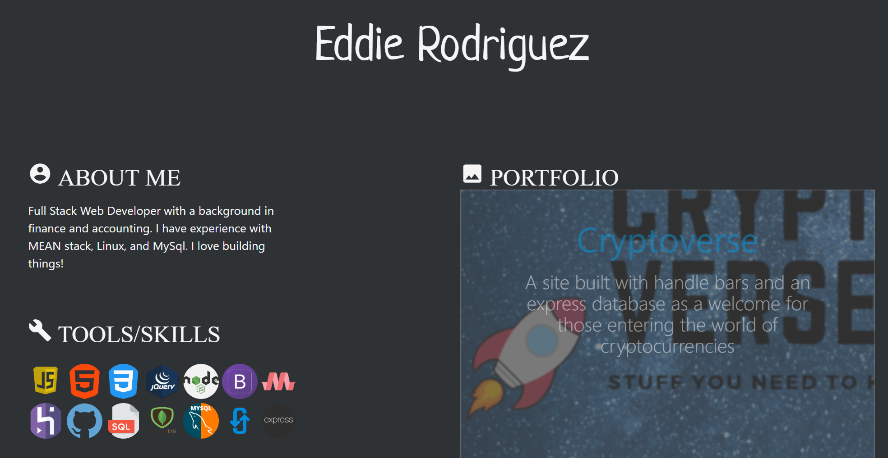

# Material Portfolio
#### GitHub:  https://erodriguez87.github.io/portfolio-materialize/

## Description:
Flat, material design inspired portfolio page. This was built to help me showcase some of the development I have created as well as to help me track my learning on new technologies.

## Built With
- Materialize CSS - Front-end HTML, CSS, javascript framework for creating responsive web applications
- JavaScript - Programming language
- jQuery - Javascript library

## Authors:  
Eddie Rodriguez